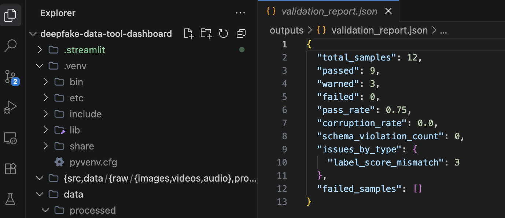
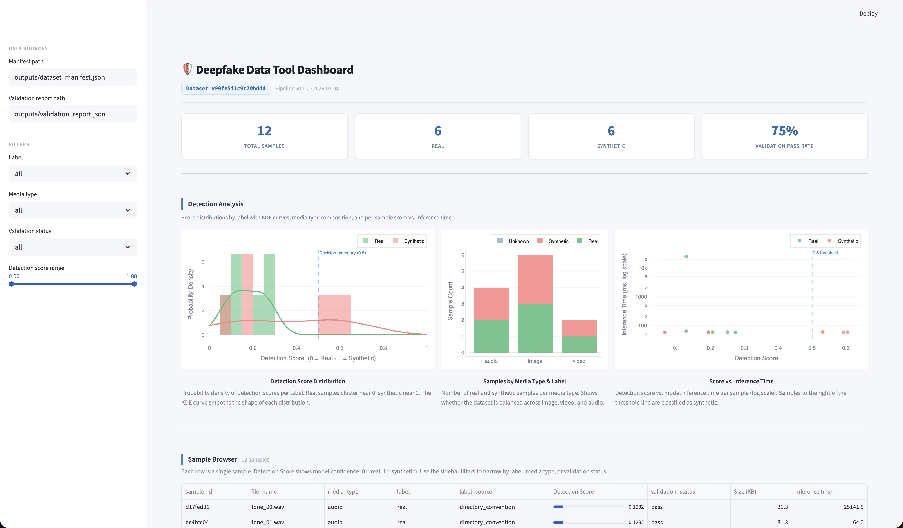
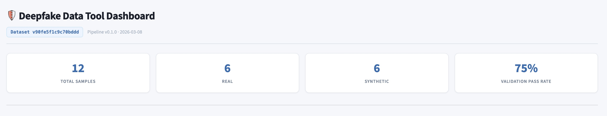
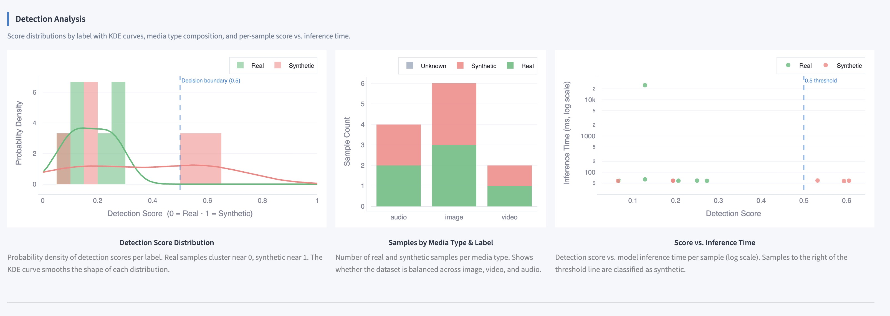
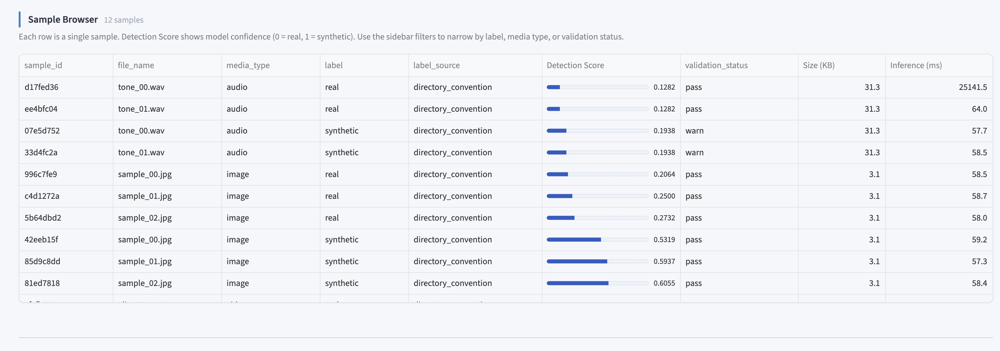
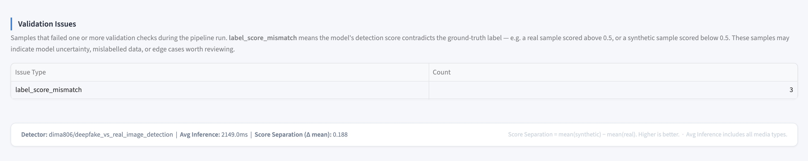

# 🔬 Deepfake Data Forge

**Deepfake Data Forge** is an MLOps-style dataset preparation pipeline and visualization dashboard designed specifically for deepfake detection models. It automates the discovery, preprocessing, metadata extraction, validation, and scoring of multimedia (images, audio, and video) to build high-quality, reliable datasets.

---

## 🎯 Project Purpose

Training robust deepfake detection models requires massive amounts of well-curated data consisting of both *real* and *synthetic* media. Creating these datasets manually is tedious, prone to errors, and difficult to scale. 

**Deepfake Data Forge** solves this by providing:
1. **Automated Pipeline Orchestration:** A standardized, modular pipeline that digests raw media, normalizes it, and extracts ground-truth metadata.
2. **Inference & Scoring:** Integration with HuggingFace models to run baseline detection inference (scoring how "fake" a sample looks/sounds) during dataset creation.
3. **Data Quality Validation:** Automated checks to ensure all media meets strict quality standards and formatting before it ever reaches a training run.
4. **Interactive Explorer:** A rich Streamlit dashboard to visually explore dataset distributions, validation reports, and baseline model scores.

## Relationship to v1

> 👉 For a walkthrough of the core pipeline architecture and project structure,
> see the [v1 repository](https://github.com/michaelromero212/deepfake-data-tool).

**Why the validation results look different between v1 and v2:**

v1 uses a mock detector that simulates scores using statistical distributions —
results are clean and deterministic by design, making it easy to inspect the
pipeline structure.



v2 integrates a real pre-trained ViT model
([dima806/deepfake_vs_real_image_detection](https://huggingface.co/dima806/deepfake_vs_real_image_detection))
running actual inference. The 3 `label_score_mismatch` warnings you'll see in
v2's validation report are the model flagging samples where its confidence
disagrees with the assigned label — expected behavior when scoring synthetic
sample images (solid-color test frames) that don't resemble the face data the
model was trained on. On a real dataset of human faces, these warnings surface
genuine mislabelling candidates for human review.


This difference between v1 and v2 intentionally demonstrates the progression
from a testable mock pipeline to a live ML inference system.

---

## 📸 Dashboard Overview & Screenshots

The included Streamlit dashboard provides deep insights into the dataset generation and validation process.

### Full Dashboard View
Here is a complete view of the Deepfake Data Forge Streamlit dashboard.


### 1. High-Level Metrics
Get an instant overview of the total samples, media types (audio, video, images), and label distribution (real vs. synthetic) in the current dataset iteration.


### 2. Detection Score Distribution
Visualizes how well the baseline models distinguish between real and synthetic media across the dataset. The histogram shows the distribution of scores, with a decision boundary indicating the split.


### 3. Validation Report & Media Types
A breakdown of the data validation status. The donut chart instantly shows the pass/warn/fail rate for pipeline processing, while the bar chart displays the distribution of data across different media formats.


### 4. Interactive Sample Browser
A detailed, filterable data table containing every sample's metadata, detection scores, file sizes, validation status, and inference times. Filter and sort directly in the browser to isolate specific edge cases.


---

## 🧠 Detection Models

Deepfake Data Forge integrates directly with pre-trained vision models to generate baseline confidence scores for how "fake" a piece of media appears.

Currently supported out-of-the-box:
- **Primary Model**: [`dima806/deepfake_vs_real_image_detection`](https://huggingface.co/dima806/deepfake_vs_real_image_detection) — A Vision Transformer (ViT-base) model served via HuggingFace's `transformers` library. 
- **ONNX Mode**: The pipeline also supports dropping in standard ONNX format detection models into the `models/` directory for accelerated CPU/GPU inference without the heavy Python ecosystem overhead.

---

## 🧪 Sample Data Generation

To allow developers to immediately test the dashboard and pipeline without downloading massive deepfake datasets (like DFDC or FaceForensics++), the repository includes a standalone local data generation script (`scripts/generate_sample_data.py`).

Running the script automatically generates a tiny, mathematically-synthetic dataset in the `data/raw/` folder using Python standard libraries, NumPy, and OpenCV:
- **Images:** Generates 128x128 solid-color matrices with randomized Gaussian noise. "Real" labeled images are skewed green; "Synthetic" labeled images are skewed red. 
- **Audio:** Generates pure 1-second sine wave `WAV` files (A4 440Hz for "Real" and A5 880Hz for "Synthetic").
- **Video:** Generates short `MP4` clips containing solid colored frames (running at 10 FPS).

This ensures you can always validate the end-to-end data engineering pipeline, metadata extraction, validation schema rules, and HuggingFace inference scoring on your local machine instantly, regardless of your internet connection or storage constraints.

---

## 🛠 Tech Stack

- **Core Application:** Python 3.10+
- **Data Engineering / Processing:** Polars, NumPy, OpenCV, Pillow, Librosa, Soundfile
- **ML / Inference:** PyTorch, Transformers (HuggingFace)
- **Visualization:** Streamlit, Matplotlib
- **Orchestration & Tooling:** Click (CLI), Rich (Terminal UI), Pydantic (Schema Validation)
- **Infrastructure:** Moto/Boto3 (AWS S3 Integration)
- **Dependency Management:** Pip / Hatchling

---

## 🚀 Getting Started

### Prerequisites
- Python 3.10 or higher
- Git

### 1. Clone & Setup Environment
```bash
git clone https://github.com/YOUR_USERNAME/deepfake-data-tool-dashboard.git
cd deepfake-data-tool-dashboard

# Create and activate virtual environment
python3 -m venv .venv
source .venv/bin/activate
```

### 2. Configure Secrets
Create a `.env` file in the root directory and add your HuggingFace API token:
```bash
HUGGINGFACE_TOKEN=your_token_here
```
*(Note: `.env` is ignored by Git for security).*

### 3. Install Dependencies
```bash
# Install the package and its requirements in editable mode
pip install -e "."
```

### 4. Generate Sample Data
To test the pipeline without an external dataset, generate synthetic test files:
```bash
python scripts/generate_sample_data.py
```

### 5. Run the Pipeline
Execute the full MLOps pipeline to process `data/raw/` and output manifest/validation reports into `outputs/`:
```bash
python -m src.pipeline run
```

### 6. Launch the Dashboard
Once the manifest is generated, explore the data in the Streamlit dashboard:
```bash
streamlit run dashboard.py
```

---

## 🗂 Project Structure
```text
deepfake-data-tool-dashboard/
├── data/
│   ├── raw/             # Raw input media (images, audio, video)
│   └── processed/       # Pipeline output (normalized, frames extracted)
├── outputs/             # Generated dataset_manifest.json and validation_report.json
├── screenshots/         # Dashboard screenshots for documentation
├── scripts/
│   └── generate_sample_data.py
├── src/
│   ├── ingestion.py     # Discovers media and derives labels
│   ├── metadata.py      # Computes hashes and structural metadata
│   ├── preprocessing.py # Normalizes data (e.g., video frame extraction)
│   ├── detection.py     # Runs deepfake detection inference (HuggingFace)
│   ├── validation.py    # Ensures schemas and quality standards match
│   ├── schemas.py       # Pydantic models for the pipeline
│   ├── storage.py       # S3 upload functionality
│   └── pipeline.py      # Main CLI orchestrator
├── tests/               # Unit tests (pytest)
├── dashboard.py         # Streamlit web app
└── pyproject.toml       # Python dependencies and build config
```
